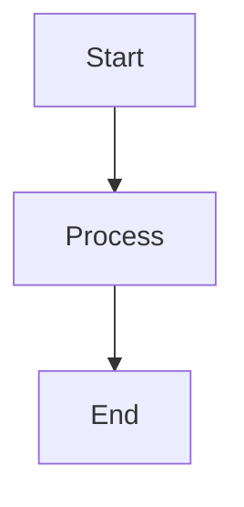

# 🚀 Deployment Guide - How to Update Your Blog

This guide walks you through updating and deploying your blog to GitHub Pages.

---

## 📝 Quick Reference

```bash
# 1. Add/edit content in content/posts/
# 2. Test locally
python3 serve.py
# 3. Deploy to GitHub Pages
./deploy-gh-pages.sh
```

---

## 📚 Detailed Step-by-Step Guide

### **Option 1: Adding a New Blog Post**

#### Step 1: Create a New Post File

Create a new Markdown file in `content/posts/` with this naming format:
```
YYYY-MM-DD-post-title.md
```

**Example:**
```bash
nano content/posts/2024-11-05-my-new-post.md
```

#### Step 2: Add Front Matter and Content

Start your file with YAML front matter:

```markdown
---
title: Your Post Title
date: 2024-11-05
tags: python, tutorial, web-development
description: A brief description of your post (used for previews)
---

# Your Post Title

Your content here...

## You can use headings

Write paragraphs with **bold** and *italic* text.

### Math Equations

Inline math: $E = mc^2$

Display math:
$$
\int_0^\infty e^{-x^2} dx = \frac{\sqrt{\pi}}{2}
$$

### Code Blocks

```python
def hello_world():
    print("Hello, World!")
```

### Mermaid Diagrams


```

#### Step 3: Save the File

Save and close your editor (`Ctrl+X` in nano, `:wq` in vim).

---

### **Option 2: Editing Existing Content**

#### Step 1: Open the File

```bash
nano content/posts/2024-11-04-advanced-mathematics-with-katex.md
```

#### Step 2: Make Your Changes

Edit the content as needed.

#### Step 3: Save the File

Save and close your editor.

---

### **Option 3: Editing Site Settings**

To change site title, description, or other settings:

```bash
nano build.py
```

Find the configuration section (lines 25-29) and update:

```python
SITE_TITLE = "Your Blog Name"
SITE_URL = "https://tranhoangkhuongvn.github.io/my-blog"
BASE_PATH = "/my-blog"  # Keep this as-is for GitHub Pages
SITE_DESCRIPTION = "Your blog description"
AUTHOR = "Your Name"
```

---

## 🧪 Testing Locally (Optional but Recommended)

Before deploying, you can test your site locally:

### Step 1: Build the Site

```bash
python3 build.py
```

**What this does:** Converts your Markdown files to HTML and puts them in `output/`

### Step 2: Start Local Server

```bash
python3 serve.py
```

**What this does:** Starts a web server on your computer

### Step 3: View in Browser

Open your browser and go to:
```
http://localhost:8001
```

**Note:** If port 8001 is in use, use:
```bash
cd output && python3 -m http.server 8002
```
Then visit `http://localhost:8002`

### Step 4: Stop the Server

Press `Ctrl+C` in the terminal to stop the server.

---

## 🚀 Deploying to GitHub Pages

Once you're happy with your changes, deploy them:

### **Method 1: Using the Automated Script (Easiest)**

```bash
./deploy-gh-pages.sh
```

**What this does:**
1. Builds your site (`python3 build.py`)
2. Creates `.nojekyll` file for GitHub Pages
3. Creates a git repository in the `output/` folder
4. Pushes the built site to the `gh-pages` branch on GitHub

**Expected output:**
```
📦 Building site...
🚀 Building static site...
  ✓ Copied static files
  ✓ Processing: [your posts]
  ✓ Generated index, archive, and RSS feed
✅ Deployed successfully!
```

### **Method 2: Manual Deployment**

If you prefer to do it step-by-step:

```bash
# Build the site
python3 build.py

# Deploy
cd output
touch .nojekyll
git init
git add -A
git commit -m "Update blog content"
git branch -M gh-pages
git remote add origin https://github.com/tranhoangkhuongvn/my-blog.git
git push -f origin gh-pages
cd ..
rm -rf output/.git
```

---

## 🔄 Committing Source Code Changes (Optional)

If you want to save your source files (Markdown, templates, etc.) to GitHub:

```bash
# Stage all changes
git add .

# Commit with a message
git commit -m "Add new blog post about X"

# Push to GitHub
git push origin main
```

**Note:** This updates the `main` branch (your source code), not the live site. The live site is on the `gh-pages` branch.

---

## ⏱️ How Long Does Deployment Take?

- **Build time:** 1-5 seconds locally
- **Push to GitHub:** 5-10 seconds
- **GitHub Pages rebuild:** 1-2 minutes

**Total time:** About 2-3 minutes from running `./deploy-gh-pages.sh` to seeing changes live.

---

## 🌐 Viewing Your Live Site

Your site is always available at:
```
https://tranhoangkhuongvn.github.io/my-blog/
```

After deploying, wait 1-2 minutes, then refresh your browser (or use `Ctrl+Shift+R` to hard refresh).

---

## 🔍 Troubleshooting

### Problem: "Permission denied" when running scripts

**Solution:**
```bash
chmod +x deploy-gh-pages.sh
```

### Problem: "Port already in use" when testing locally

**Solution:** Use a different port:
```bash
cd output && python3 -m http.server 8002
```

### Problem: Changes not showing on live site

**Solutions:**
1. Wait 2-3 minutes for GitHub Pages to rebuild
2. Hard refresh your browser (`Ctrl+Shift+R` or `Cmd+Shift+R`)
3. Clear your browser cache
4. Check that deployment succeeded (no errors in terminal)

### Problem: CSS not loading

**Solution:** Make sure `BASE_PATH = "/my-blog"` is set correctly in `build.py`

### Problem: Math equations not rendering

**Solution:**
1. Check that you're using the correct syntax: `$...$` for inline, `$$...$$` for display
2. Make sure the post front matter is properly closed with `---`
3. Rebuild: `python3 build.py`

---

## 📋 Complete Workflow Example

Let's say you want to write a new post about Docker:

```bash
# 1. Create the post
nano content/posts/2024-11-05-docker-tutorial.md

# 2. Write your content (see template above), then save

# 3. Test locally (optional)
python3 build.py
python3 serve.py
# Visit http://localhost:8001 in browser
# Press Ctrl+C to stop server

# 4. Deploy to GitHub Pages
./deploy-gh-pages.sh

# 5. Save source code to GitHub (optional)
git add .
git commit -m "Add Docker tutorial post"
git push origin main

# 6. Visit your site (wait 1-2 minutes)
# https://tranhoangkhuongvn.github.io/my-blog/
```

Done! Your new post is live. 🎉

---

## 💡 Pro Tips

### Tip 1: Preview Before Deploying
Always test locally first to catch any formatting issues:
```bash
python3 build.py && python3 serve.py
```

### Tip 2: Use Make Commands
The Makefile has shortcuts:
```bash
make build    # Build the site
make serve    # Build and serve locally
make clean    # Clean output directory
```

### Tip 3: Draft Posts
To work on a post without publishing it, store it outside `content/posts/`:
```bash
nano drafts/my-draft-post.md
```

When ready to publish, move it:
```bash
mv drafts/my-draft-post.md content/posts/2024-11-05-my-post.md
```

### Tip 4: Batch Updates
You can edit multiple posts at once, then deploy all changes together:
```bash
# Edit multiple files
nano content/posts/post1.md
nano content/posts/post2.md
nano content/posts/post3.md

# Deploy all at once
./deploy-gh-pages.sh
```

### Tip 5: Quick Fixes
For typos or small edits:
```bash
nano content/posts/2024-11-04-advanced-mathematics-with-katex.md
./deploy-gh-pages.sh
```
2-3 minutes later, your fix is live!

---

## 🎯 Summary Cheat Sheet

| Task | Command |
|------|---------|
| Create new post | `nano content/posts/YYYY-MM-DD-title.md` |
| Edit existing post | `nano content/posts/[filename].md` |
| Build site | `python3 build.py` |
| Test locally | `python3 serve.py` |
| Deploy to web | `./deploy-gh-pages.sh` |
| Save to GitHub | `git add . && git commit -m "message" && git push` |
| View live site | https://tranhoangkhuongvn.github.io/my-blog/ |

---

## 📞 Getting Help

If you encounter issues:

1. **Check the build output** - Errors will show in terminal
2. **Re-read this guide** - Most issues are covered in Troubleshooting
3. **Check GitHub Actions** - Go to your repo → Actions tab
4. **Verify GitHub Pages settings** - Settings → Pages → Branch should be `gh-pages`

---

## 🎓 Learning More

### Markdown Syntax
- [Markdown Guide](https://www.markdownguide.org/basic-syntax/)
- [GitHub Flavored Markdown](https://guides.github.com/features/mastering-markdown/)

### Math with KaTeX
- [KaTeX Supported Functions](https://katex.org/docs/supported.html)
- Use `$inline math$` and `$$display math$$`

### Mermaid Diagrams
- [Mermaid Documentation](https://mermaid.js.org/)
- [Mermaid Live Editor](https://mermaid.live/)

---

**Happy blogging! 🚀✨**
