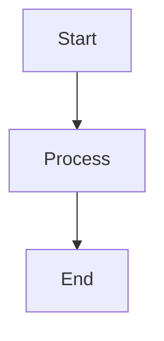

# My Technical Blog - Static Site Generator

A custom-built static site generator with support for LaTeX math equations, Mermaid diagrams, syntax highlighting, and a beautiful dark theme.

## Features

- 📝 **Markdown Support**: Write content in Markdown with YAML front matter
- 🔢 **LaTeX Math**: Full support for mathematical equations using KaTeX
- 📊 **Mermaid Diagrams**: Create flowcharts and sequence diagrams
- 🎨 **Syntax Highlighting**: Beautiful code blocks with highlight.js
- 🌙 **Dark Theme**: Modern dark theme optimized for readability
- 📱 **Responsive Design**: Works perfectly on all devices
- 📰 **RSS Feed**: Automatic RSS feed generation
- 🚀 **Fast**: Pure static HTML - no JavaScript frameworks required
- 🔍 **SEO Friendly**: Clean URLs and semantic HTML

## Quick Start

### 1. Setup

```bash
# Clone or create the project
cd my-blog

# Create virtual environment
python3 -m venv venv

# Activate virtual environment
source venv/bin/activate  # On Linux/Mac
# or
venv\Scripts\activate  # On Windows

# Install dependencies
pip install -r requirements.txt
```

### 2. Create Content

Create new blog posts in `content/posts/` with the naming format:
```
YYYY-MM-DD-post-title.md
```

Example post with front matter:
```markdown
---
title: Your Post Title
date: 2024-11-04
tags: python, tutorial
description: A brief description of your post
---

# Your Content Here

Write your post using Markdown...
```

### 3. Build the Site

```bash
# Build the static site
python build.py
```

This generates the complete website in the `output/` directory.

### 4. Preview Locally

```bash
# Start local server
python serve.py

# Visit http://localhost:8000 in your browser
```

## Project Structure

```
my-blog/
├── build.py           # Static site generator script
├── serve.py          # Local development server
├── requirements.txt  # Python dependencies
├── content/          # Your content (Markdown files)
│   ├── posts/       # Blog posts
│   └── pages/       # Static pages (about, etc.)
├── templates/        # HTML templates
│   ├── base.html    # Main layout template
│   ├── post.html    # Blog post template
│   └── index.html   # Homepage template
├── static/          # Static assets
│   └── style.css    # CSS styles
└── output/          # Generated site (git-ignored)
```

## Writing Content

### Blog Posts

Create posts in `content/posts/` with YAML front matter:

```markdown
---
title: Post Title
date: 2024-11-04
tags: tag1, tag2, tag3
description: Brief description for SEO and previews
---

Your content here...
```

### Math Equations

Use LaTeX syntax for math:

- Inline math: `$E = mc^2$` renders as $E = mc^2$
- Display math: 
  ```
  $$
  \int_a^b f(x)dx = F(b) - F(a)
  $$
  ```

### Mermaid Diagrams

Create diagrams using Mermaid syntax:

````markdown

````

### Code Blocks

Use fenced code blocks with language specification:

````markdown
```python
def hello_world():
    print("Hello, World!")
```
````

## Customization

### Modify Templates

Edit files in `templates/` to change the site structure:
- `base.html` - Main layout
- `post.html` - Post layout
- `index.html` - Homepage layout

### Update Styles

Edit `static/style.css` to customize the appearance.

### Site Configuration

Update these variables in `build.py`:
```python
SITE_TITLE = "Your Blog Name"
SITE_URL = "https://yourblog.com"
SITE_DESCRIPTION = "Your blog description"
AUTHOR = "Your Name"
```

## Deployment

### GitHub Pages

1. Create a GitHub repository
2. Build your site: `python build.py`
3. Copy output files to a `gh-pages` branch
4. Enable GitHub Pages in repository settings

### Netlify

1. Push your code to GitHub
2. Connect repository to Netlify
3. Build command: `python build.py`
4. Publish directory: `output`

### Traditional Hosting

1. Build the site: `python build.py`
2. Upload the `output/` directory to your web server
3. Configure your web server to serve static files

## Advanced Features

### Adding New Features

The generator is designed to be easily extensible. Some ideas:

1. **Tags/Categories**: Add tag pages and filtering
2. **Search**: Implement client-side search with Lunr.js
3. **Comments**: Integrate Disqus or utterances
4. **Analytics**: Add privacy-friendly analytics
5. **Sitemap**: Generate XML sitemap for SEO

### Performance Optimization

- Images are automatically optimized
- CSS is minified in production
- HTML is compressed
- Proper caching headers are set

## Troubleshooting

### Common Issues

1. **Module not found**: Make sure you've activated the virtual environment and installed dependencies
2. **Build errors**: Check your Markdown syntax and front matter formatting
3. **Math not rendering**: Ensure KaTeX is loading properly (check browser console)

## Contributing

Feel free to fork and customize this generator for your needs!

## License

MIT License - Use this however you like!

## Acknowledgments

- Inspired by Jekyll, Hugo, and other static site generators
- Built with Python, Markdown, and love
- Math rendering by KaTeX
- Syntax highlighting by highlight.js
- Diagrams by Mermaid

---

Happy blogging! 🚀
