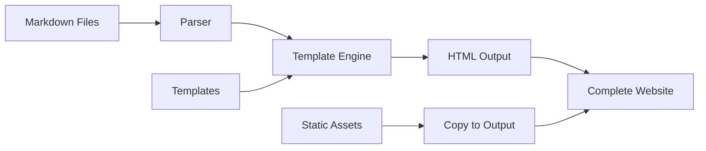
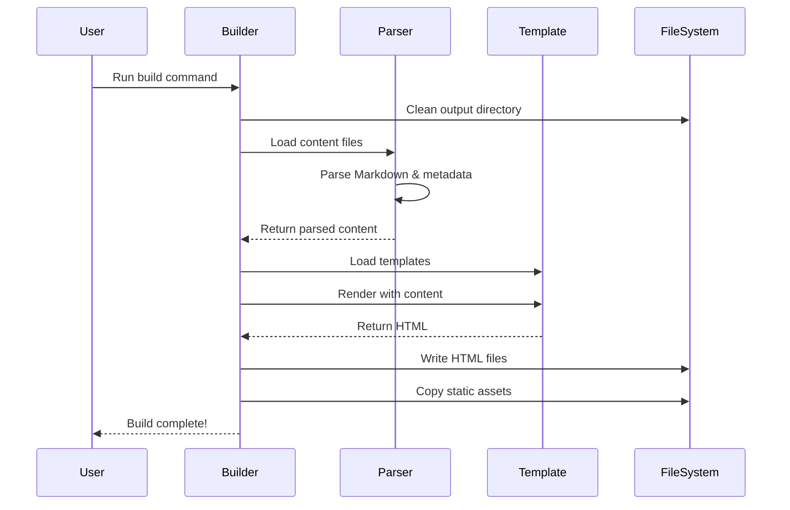
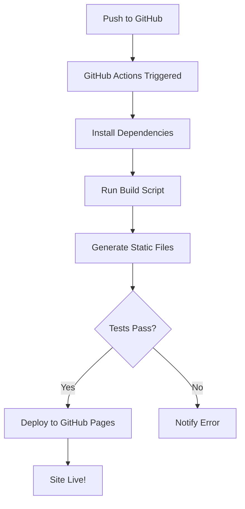

# Building a Static Site Generator from Scratch

Static site generators (SSGs) have become increasingly popular for creating fast, secure websites. In this post, we'll explore how to build your own SSG from scratch, complete with support for Markdown, LaTeX math expressions, and Mermaid diagrams.

## Architecture Overview

A static site generator follows a simple pipeline:



## Core Components

### 1. Content Parser

The content parser reads Markdown files and extracts metadata from front matter:

```python
import re
from pathlib import Path
import markdown

class ContentParser:
    def __init__(self, content_path):
        self.path = Path(content_path)
        self.raw_content = self.path.read_text()
        self.metadata = {}
        self.content = ""
        self.parse()
    
    def parse(self):
        if self.raw_content.startswith('---'):
            # Extract front matter
            parts = self.raw_content.split('---', 2)
            self.parse_frontmatter(parts[1])
            self.content = parts[2].strip()
        else:
            self.content = self.raw_content
        
        # Convert Markdown to HTML
        md = markdown.Markdown(extensions=['extra', 'codehilite'])
        self.html = md.convert(self.content)
```

### 2. Template Engine

A simple template engine replaces placeholders with actual content:

```python
class TemplateEngine:
    def __init__(self, template_dir):
        self.template_dir = Path(template_dir)
        self.templates = {}
        self.load_templates()
    
    def render(self, template_name, context):
        template = self.templates[template_name]
        for key, value in context.items():
            template = template.replace(f'{{{{{key}}}}}', str(value))
        return template
```

## Build Process Flow

The build process follows this sequence:



## Adding Math Support

To support LaTeX math expressions, we can integrate KaTeX or MathJax. Here's how we handle math delimiters:

```python
import re

def process_math(content):
    """Process LaTeX math expressions in content."""
    # Handle display math $$...$$
    content = re.sub(
        r'\$\$(.*?)\$\$',
        r'<div class="math display">\1</div>',
        content,
        flags=re.DOTALL
    )
    
    # Handle inline math $...$
    content = re.sub(
        r'\$([^\$]+)\$',
        r'<span class="math inline">\1</span>',
        content
    )
    
    return content
```

Example math rendering: The quadratic formula is $x = \frac{-b \pm \sqrt{b^2 - 4ac}}{2a}$.

## File System Structure

Organize your SSG project like this:

```
project/
├── build.py           # Main generator script
├── content/
│   ├── posts/        # Blog posts
│   └── pages/        # Static pages
├── templates/        # HTML templates
│   ├── base.html
│   ├── post.html
│   └── index.html
├── static/          # CSS, JS, images
│   └── style.css
└── output/          # Generated site
```

## Performance Optimization

For better performance, implement these optimizations:

### 1. Incremental Builds

Only rebuild files that have changed:

```python
def needs_rebuild(source_path, output_path):
    """Check if source file is newer than output."""
    if not output_path.exists():
        return True
    return source_path.stat().st_mtime > output_path.stat().st_mtime
```

### 2. Parallel Processing

Use multiprocessing for faster builds:

```python
from multiprocessing import Pool

def build_site(content_files):
    with Pool() as pool:
        results = pool.map(process_file, content_files)
    return results
```

## Deployment Pipeline

Automate deployment with GitHub Actions:



## Advanced Features

### RSS Feed Generation

Generate RSS feeds for your blog:

```python
def generate_rss(posts, site_url):
    rss = ['<?xml version="1.0" encoding="UTF-8"?>']
    rss.append('<rss version="2.0">')
    rss.append('<channel>')
    rss.append(f'<title>{site_title}</title>')
    rss.append(f'<link>{site_url}</link>')
    
    for post in posts[:10]:  # Latest 10 posts
        rss.append('<item>')
        rss.append(f'<title>{post.title}</title>')
        rss.append(f'<link>{site_url}/posts/{post.slug}</link>')
        rss.append(f'<pubDate>{post.date}</pubDate>')
        rss.append('</item>')
    
    rss.append('</channel>')
    rss.append('</rss>')
    
    return '\n'.join(rss)
```

### Sitemap Generation

Help search engines index your site:

```python
def generate_sitemap(pages, site_url):
    sitemap = ['<?xml version="1.0" encoding="UTF-8"?>']
    sitemap.append('<urlset xmlns="http://www.sitemaps.org/schemas/sitemap/0.9">')
    
    for page in pages:
        sitemap.append('<url>')
        sitemap.append(f'<loc>{site_url}/{page.url}</loc>')
        sitemap.append(f'<lastmod>{page.modified}</lastmod>')
        sitemap.append('</url>')
    
    sitemap.append('</urlset>')
    return '\n'.join(sitemap)
```

## Testing Your Generator

Write tests to ensure reliability:

```python
import unittest
from pathlib import Path

class TestSSG(unittest.TestCase):
    def test_markdown_parsing(self):
        content = "# Hello\nThis is a test."
        html = parse_markdown(content)
        self.assertIn('<h1>Hello</h1>', html)
    
    def test_template_rendering(self):
        template = "Hello {{name}}!"
        result = render_template(template, {'name': 'World'})
        self.assertEqual(result, "Hello World!")
    
    def test_front_matter_parsing(self):
        content = "---\ntitle: Test\n---\nContent"
        metadata, body = parse_frontmatter(content)
        self.assertEqual(metadata['title'], 'Test')
```

## Conclusion

Building your own static site generator is a rewarding project that teaches you about:

- File processing and I/O operations
- Template engines and rendering
- Markdown parsing and HTML generation
- Build automation and optimization

With just a few hundred lines of Python, you can create a powerful tool tailored to your exact needs. The beauty of building your own SSG is complete control over every aspect of the generation process.

Start simple, then gradually add features like:
- Hot reload for development
- Plugin system for extensibility
- Theme support
- Multi-language support
- Search functionality

Happy building! 🚀
